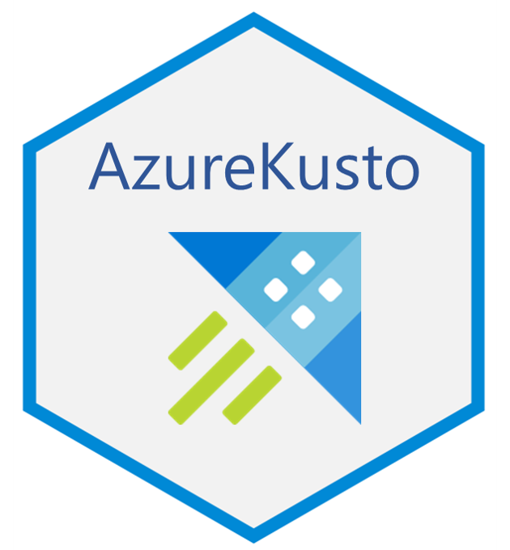

# AzureKusto 

[](https://cran.r-project.org/package=AzureKusto)

[](https://asiadatascience.visualstudio.com/AzureR/_build/latest?definitionId=8&branchName=master)

R interface to Kusto, also known as [Azure Data Explorer](https://azure.microsoft.com/en-us/services/data-explorer/), a fast and highly scalable data exploration service.

## Installation

AzureKusto is available on [CRAN](https://cran.r-project.org/package=AzureKusto). If you are using Microsoft R, the latest version of the package may not be in your default MRAN snapshot. You can set the repository to CRAN before installing.

```r
options(repos="https://cloud.r-project.org")
install.packages("AzureKusto")
```

You can install the development version from GitHub. The primary repo is https://github.com/Azure/AzureKusto; please submit issues and pull requests there. AzureKusto is also mirrored at the Cloudyr organisation, at https://github.com/cloudyr/AzureKusto.

```r
devtools::install_github("Azure/AzureKusto")
```

## Example usage

### Kusto endpoint interface

Connect to a Kusto cluster by instantiating a `kusto_database_endpoint` object with the cluster URI and database name.

```r

library(AzureKusto)

Samples <- kusto_database_endpoint(server="https://help.kusto.windows.net", database="Samples")

# To sign in, use a web browser to open the page https://microsoft.com/devicelogin and enter the code [your device code here] to authenticate.
# Waiting for device code in browser...
# Press Esc/Ctrl + C to abort
# Authentication complete.
```

Now you can issue queries to the Kusto database with `run_query` and get the results back as a data.frame.

```r

res <- run_query(Samples, "StormEvents | summarize EventCount = count() by State | order by State asc")

head(res)

##            State EventCount
## 1        ALABAMA       1315
## 2         ALASKA        257
## 3 AMERICAN SAMOA         16
## 4        ARIZONA        340
## 5       ARKANSAS       1028
## 6 ATLANTIC NORTH        188

```

`run_query()` also supports query parameters. Simply pass your parameters as additional keyword arguments and they will be escaped and interpolated into the query string.

```r

res <- run_query(Samples, "MyFunction(lim)", lim=10L)

```

Command statements work much the same way, except that they do not accept parameters.

```r

res <- run_query(Samples, ".show tables")

```

### dplyr Interface

The package also implements a [dplyr](https://github.com/tidyverse/dplyr)-style interface for building a query upon a `tbl_kusto` object and then running it on the remote Kusto database and returning the result as a regular tibble object with `collect()`.

```r

library(dplyr)

StormEvents <- tbl_kusto(Samples, "StormEvents")

q <- StormEvents %>%
    group_by(State) %>%
    summarize(EventCount=n()) %>%
    arrange(State)

show_query(q)

## <KQL> database('Samples').['StormEvents']
## | summarize ['EventCount'] = count() by ['State']
## | order by ['State'] asc

collect(q)

## # A tibble: 67 x 2
##    State          EventCount
##    <chr>               <dbl>
##  1 ALABAMA              1315
##  2 ALASKA                257
##  3 AMERICAN SAMOA         16
##  4 ARIZONA               340
##  5 ARKANSAS             1028
##  6 ATLANTIC NORTH        188
##  7 ATLANTIC SOUTH        193
##  8 CALIFORNIA            898
##  9 COLORADO             1654
## 10 CONNECTICUT           148
## # ... with 57 more rows

```

`tbl_kusto` also accepts query parameters, in case the Kusto source table is a parameterized function:

```r

MyFunctionDate <- tbl_kusto(Samples, "MyFunctionDate(dt)", dt=as.Date("2019-01-01"))

MyFunctionDate %>%
    select(StartTime, EndTime, EpisodeId, EventId, State) %>%
    head() %>%
    collect()

## # A tibble: 6 x 5
##   StartTime           EndTime             EpisodeId EventId State         
##   <dttm>              <dttm>                  <int>   <int> <chr>         
## 1 2007-09-29 08:11:00 2007-09-29 08:11:00     11091   61032 ATLANTIC SOUTH
## 2 2007-09-18 20:00:00 2007-09-19 18:00:00     11074   60904 FLORIDA       
## 3 2007-09-20 21:57:00 2007-09-20 22:05:00     11078   60913 FLORIDA       
## 4 2007-12-30 16:00:00 2007-12-30 16:05:00     11749   64588 GEORGIA       
## 5 2007-12-20 07:50:00 2007-12-20 07:53:00     12554   68796 MISSISSIPPI   
## 6 2007-12-20 10:32:00 2007-12-20 10:36:00     12554   68814 MISSISSIPPI   

```


### DBI interface

AzureKusto implements a subset of the DBI specification for interacting with databases. It should be noted that Kusto is quite different to the SQL databases that DBI targets, which affects the behaviour of certain DBI methods and renders other moot.


```r
library(DBI)

# connect to the server: basically a wrapper for kusto_database_endpoint()
Samples <- dbConnect(AzureKusto(),
                     server="https://help.kusto.windows.net",
                     database="Samples")

dbListTables(Samples)

## [1] "StormEvents"       "demo_make_series1" "demo_series2"     
## [4] "demo_series3"      "demo_many_series1"

dbExistsTable(Samples, "StormEvents")

##[1] TRUE

dbGetQuery(Samples, "StormEvents | summarize ct = count()")

##      ct
## 1 59066
```


## Azure Resource Manager interface

On the admin side, AzureKusto extends the framework supplied by the [AzureRMR](https://github.com/Azure/AzureRMR) to support Kusto. Methods are provided to create and delete clusters and databases, and manage database principals.

```r
# create a new Kusto cluster
az <- AzureRMR::get_azure_login()
ku <- az$
    get_subscription("sub_id")$
    get_resource_group("rgname")$
    create_kusto_cluster("mykustocluster")

# create a new database
db1 <- ku$create_database("database1")

# add a user
db1$add_principals("myusername", role="User", fqn="aaduser=username@mydomain")
```

---
<p align="center"><a href="https://github.com/Azure/AzureR"></a></p>
